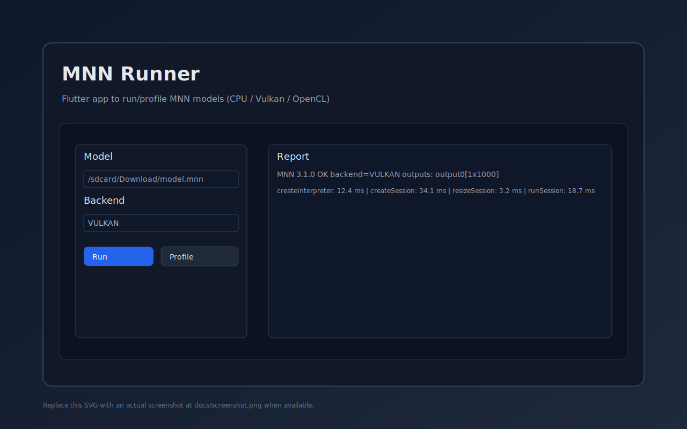

# MNN Runner

Flutter app to run and profile MNN models on Android (JNI/C++17) with a clean UI, backend probing, and metrics.

• Download: see GitHub Releases — https://github.com/katolikov/MNN_Runner/releases



## Features

- Run single or multi-input models with editable shapes.
- Backends: CPU, Vulkan, OpenCL, OpenGL (if the corresponding MNN plugins are bundled).
- High-level profiling metrics only: createInterpreter, createSession, resizeSession, runSession (no per-op timings).
- GPU kernel cache saving for Vulkan/OpenCL.
- Dark mode toggle in-app.
- Inline and fullscreen report viewer with output shapes.

## Android Native Libs (JNI)

- Place MNN shared objects under `android/app/src/main/jniLibs/<ABI>/`:
  - Required: `libMNN.so`
  - Optional plugins (ship only what you use): `libMNN_Vulkan.so`, `libMNN_CL.so`, `libMNN_GL.so`, `libMNN_Express.so`
- The app loads plugins lazily on demand. We do not auto-load `libMNN_Express.so` to avoid linker warnings when a system copy exists but is not accessible to the app namespace (Android P+ isolated namespaces).
- OpenCL: ensure your `libMNN_CL.so` defers loading the vendor driver via `dlopen` internally. We do not link `libOpenCL.so` directly.

### Why shell runs may work but APK fails

- `adb shell` uses a global linker namespace and may find vendor libs; apps run in isolated namespaces and cannot.
- Ship all required `.so` files with the APK or link only against NDK-public system libs.

### Push libs for shell-side testing

```
./scripts/push_libs.sh [arm64-v8a|armeabi-v7a]
# On device: export LD_LIBRARY_PATH=/data/local/tmp/mnn/<ABI>
```

## Build & Run

- Install Flutter and run:
  - `flutter pub get`
  - `flutter run -d android` (or `-d macos`, `-d ios`, `-d web`)
- Analyze/lint: `flutter analyze`
- Format: `dart format .`
- Test: `flutter test`

## Android Release APK

- Ensure `android/app/src/main/jniLibs/<ABI>/libMNN*.so` exist for the ABIs you target.
- Build: `flutter build apk --release`
  - Output: `build/app/outputs/flutter-apk/app-release.apk`

Note on minSdk: modern Flutter (3.24+) recommends `minSdkVersion >= 21`. Vulkan also requires API 24+ on most devices. Building for API 16 is not supported by current Flutter + plugins. If you absolutely need API 16, you’ll have to fork the project and rework the toolchain and feature set (e.g., disable modern backends and update Gradle/Flutter), which is out of scope here.

## GitHub Integration

Repository: https://github.com/katolikov/MNN_Runner

1. Ensure native libs are committed under `android/app/src/main/jniLibs/`.
2. Tag a version (e.g., `git tag v1.0.0 && git push origin v1.0.0`).
3. The provided GitHub Action builds a release APK and attaches it to the tag’s Release page.

### GitHub Actions (Android Release)

We include a simple workflow under `.github/workflows/android-release.yml`. It builds a release APK on tagged pushes and uploads it as a release asset. You can adjust Flutter version as needed.

## Screenshots

- Add a main app screenshot to `docs/screenshot.png` for the README preview.
- Optionally add more under `docs/screenshots/` and reference them here:
  - ``
  - ``

## Security Notes

- JNI expects the MNN headers under `android/app/src/main/cpp/third_party/MNN/include` and `libMNN.so` per-ABI under `android/app/src/main/jniLibs/<ABI>/`.
- Dart MethodChannel name is `mnn_runner`; method `runModel` expects a JSON with keys `modelPath`, `inputShape` (or `inputShapes`), `backend`, `memoryMode`, `precisionMode`, `powerMode`, `threads`, `inputFill`, and flags `profile`, `cache`.
